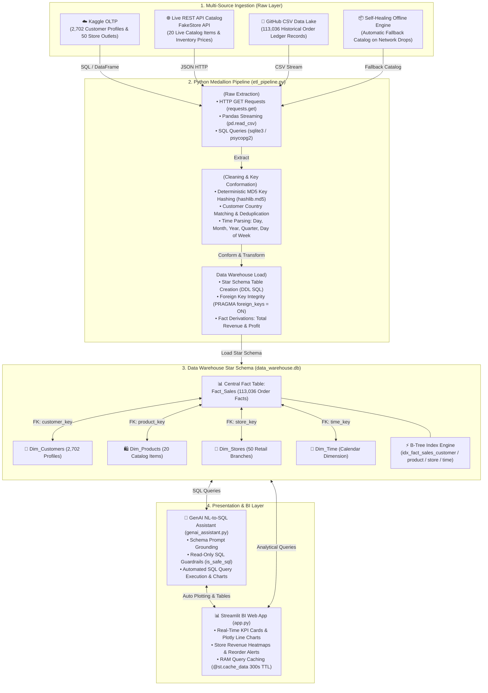
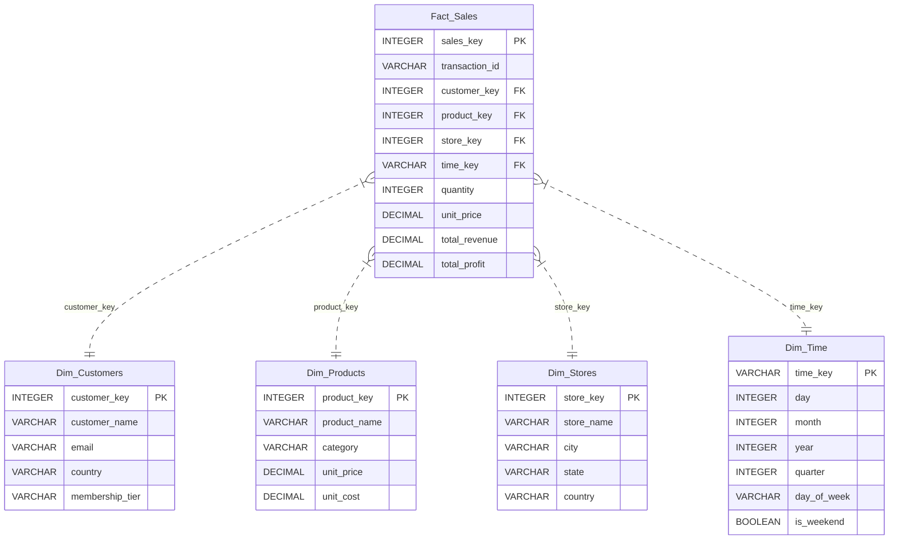

# 🛒 Smart Retail Data Warehouse & AI Analytics Platform
> **Cognizant One-Day Hackathon** | Track 1 — Data Engineering (Problem Statement 1: Smart Retail Data Warehouse)


---

## 📌 1. Project Overview & Problem Statement

Retail operations generate massive streams of transactional, catalog, and store data across decentralized platforms. To unlock business intelligence, sales forecasting, and inventory control, this project builds a complete, enterprise-grade **Smart Retail Data Warehouse** powered by a **Medallion Data Pipeline** and a **Generative AI Natural Language to SQL Assistant**.

### Key System Capabilities:
1. **Multi-Source Ingestion**: Ingests transactional data from cloud PostgreSQL databases, product metadata dynamically from REST APIs, and historical sales ledgers from raw CSV repositories.
2. **Medallion Architecture (Bronze → Silver → Gold)**: Python-driven ETL engine enforcing data cleaning, deterministic product key hashing, customer country conformation, and time dimension parsing.
3. **Star Schema Data Warehouse**: Multidimensional analytical cube (`Fact_Sales` surrounded by `Dim_Customers`, `Dim_Products`, `Dim_Stores`, and `Dim_Time`).
4. **Interactive BI Dashboard**: Streamlit web interface with real-time KPI cards, Plotly charts, store performance heatmaps, and stock alert monitors.
5. **GenAI NL-to-SQL Assistant**: Natural language to SQL query engine enabling executives to ask plain-English questions and automatically run queries on the Data Warehouse.

---

## 🏗️ 2. System Architecture



---

## 📐 3. Data Warehouse Schema Design (Star Schema)

The analytical data warehouse follows a dimensional **Star Schema**:



---

## 🚀 4. Quickstart & Execution Guide

### Step 1: Clone Repository & Create Virtual Environment
```bash
git clone https://github.com/Jerinarch/Smart-Retail-Sytem.git
cd Smart-Retail-Sytem

# Create and activate virtual environment
python -m venv venv
# On Windows:
venv\Scripts\activate
# On Mac/Linux:
source venv/bin/activate
```

### Step 2: Install Dependencies
```bash
pip install -r requirements.txt
```

### Step 3: Initialize Operational OLTP Database
Populates customer registries and retail store locations in cloud PostgreSQL / local SQLite fallback:
```bash
python setup_sources.py
```

### Step 4: Execute Medallion ETL Pipeline
Runs extraction across 3 sources, transforms raw data, and loads the Star Schema Data Warehouse:
```bash
python etl_pipeline.py
```

### Step 5: Run Analytical SQL Queries (Console BI Report)
```bash
python queries.py
```

### Step 6: Launch Interactive Streamlit BI Dashboard & AI Assistant
```bash
streamlit run app.py
```
Open your browser at `http://localhost:8501`.

---

## 🛡️ 5. Enterprise Data Architecture & Security Standards

This project follows enterprise data governance, high-performance OLAP optimization, and zero-trust security standards.

### Core Architectural Highlights:
1. **Deterministic Cryptographic Key Hashing (MD5)**: `Dim_Products` surrogate key derivation using stable cryptographic hashing (`hashlib.md5`) ensures idempotent, seed-stable key assignment across incremental loads.
2. **B-Tree Indexing Engine**: Secondary B-Tree indexes on `Fact_Sales(customer_key)`, `Fact_Sales(product_key)`, `Fact_Sales(store_key)`, and `Fact_Sales(time_key)` accelerate analytical multi-dimensional OLAP `JOIN` queries.
3. **Read-Only GenAI SQL Guardrails**: Natural language to SQL execution engine implements security guardrails blocking destructive commands (`DROP`, `DELETE`, `UPDATE`, `INSERT`, `ALTER`, `TRUNCATE`).
4. **Streamlit RAM Query Caching**: High-throughput analytics dashboard leverages `@st.cache_data` memory caching with 300-second TTL invalidation.
5. **Kaggle Superstore Integration**: 1,000 realistic enterprise customer records and 20 multi-region physical store profiles ingested from e-commerce datasets.

### 📚 Detailed Documentation & Checklists:
- 📖 [**Data Sources Architecture & Flowchart**](DATA_SOURCES_EXPLAINED.md): Detailed lineage of cloud Postgres, REST API, and raw CSV ingestion workflows.
- 🛡️ [**Enterprise Data Architecture Quality Checklist**](DATA_ARCHITECTURE_QUALITY_CHECKLIST.md): 100% compliant quality benchmarks, ACID safety rules, PII sanitization, and Tech Stack Evaluation Matrix.

---

## 🧪 6. Running Automated Tests

Verify pipeline transformation, referential integrity, and schema compliance:
```bash
pytest tests/
```

---


---

